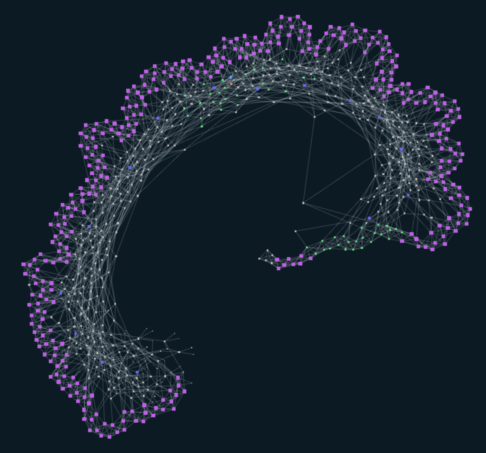
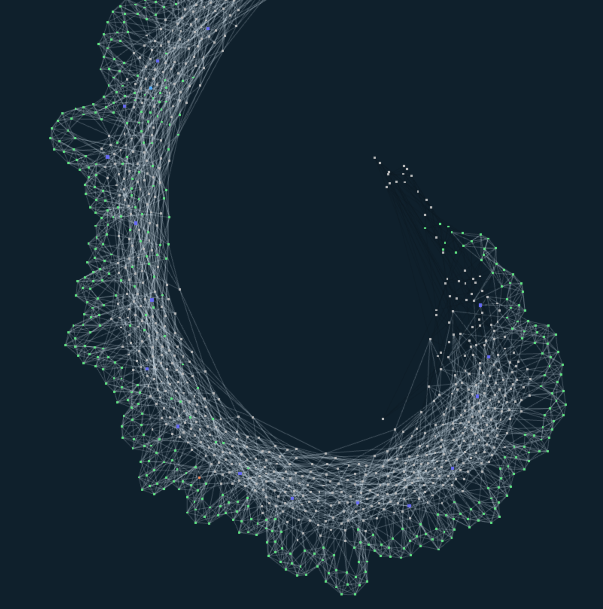
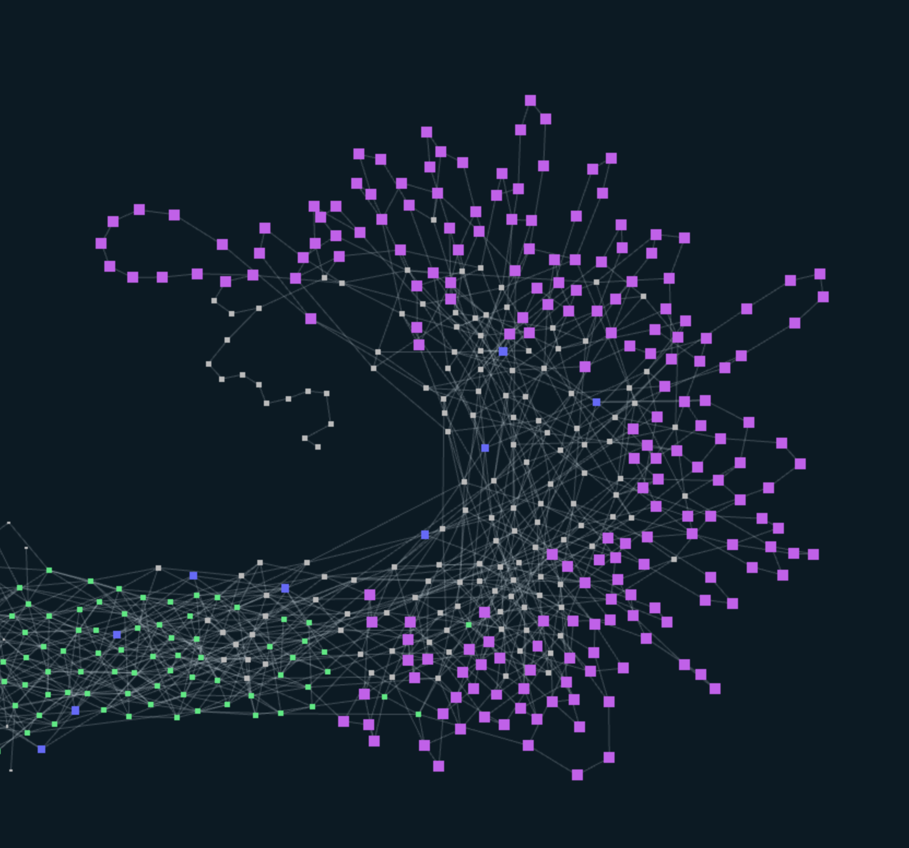
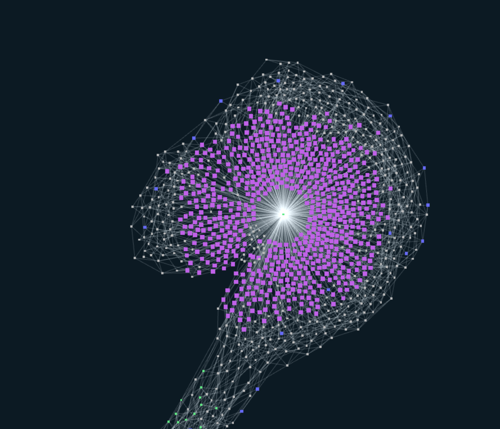

# iota-stardust-dev-challenges

[Tangle structures](#tangle-structures)

[Controlling address](#controlling-address)

[Zeros NFT ID](#zeros-nft-id)

## Tangle structures
Issue blocks that result in following structures:

Sidetangle:

Blockchain:

Blowball:

## Controlling address

Find the Ed25519 address that currently controls the output with ID `0xdd5b0f0f305e4dac2b1c66774193dbbcc43d0f03b85a26da3755e5db5d0d55160000`.

## Zeros NFT ID

Mint an NFT with an NFT ID starting with >= 2 leading zeros in the ID.
Hex encoded NFT ID must start with `0x0000`, example NFT ID `0x000000e30408fd57bf0b8f556dac652df068469d34fcaed1b1a1db24741285e8`.
